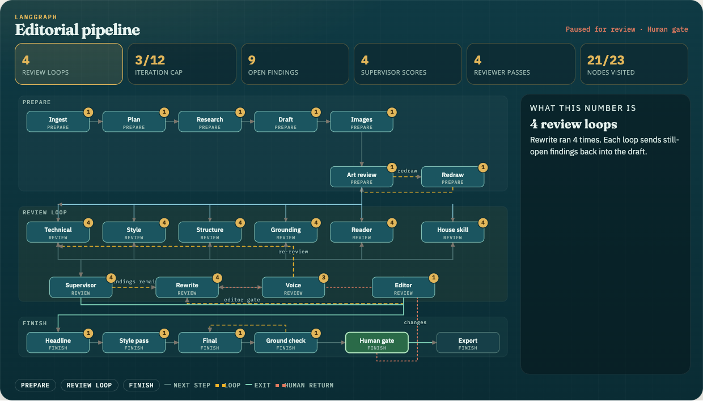
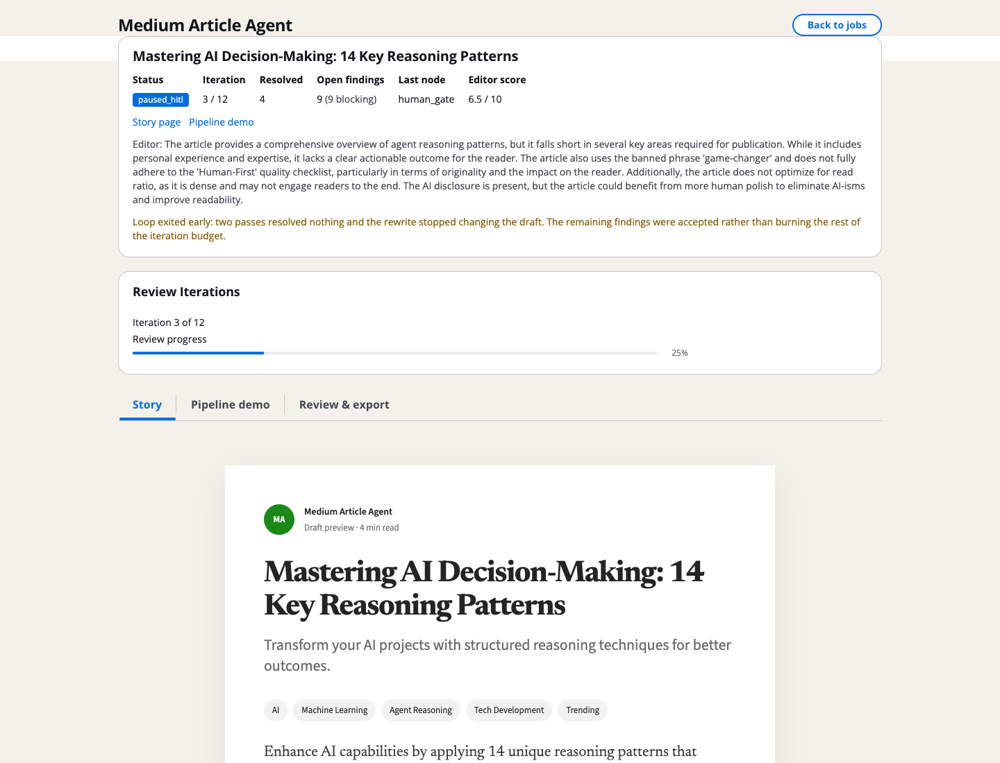
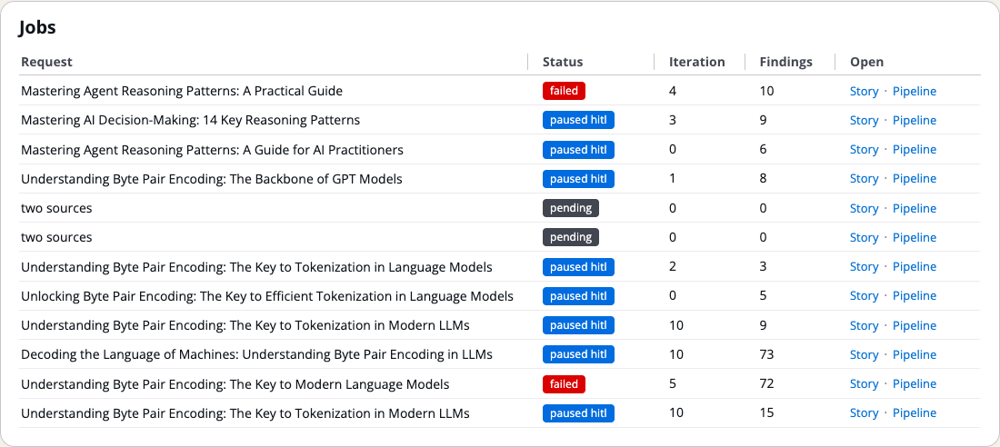
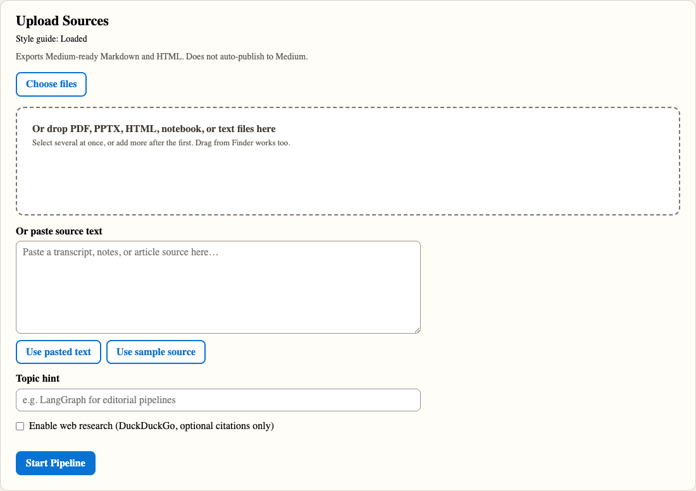
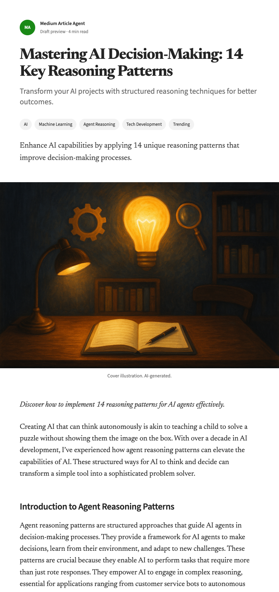

<div align="center">

# Medium Article Agent

LangGraph editorial pipeline. Upload notes, slides, or a PDF. It plans, drafts, runs six reviewers, pauses for you, and exports Medium-ready Markdown.

**It does not post to Medium.** You copy the export.

[](https://www.python.org/)
[](https://www.langchain.com/langgraph)
[](https://fastapi.tiangolo.com/)
[](./LICENSE)

</div>

<p align="center">
  
</p>
<p align="center"><em>The agent — 23 nodes, review loops, and a pause at Human gate.</em></p>

<p align="center">
  
</p>
<p align="center"><em>A live job — status, editor score, review progress, Story / Pipeline / Review &amp; export.</em></p>

<p align="center">
  
  &nbsp;
  
</p>
<p align="center"><em>Jobs board (Story / Pipeline per run) and the upload panel.</em></p>

<p align="center">
  
</p>
<p align="center"><em>Story tab — Medium-ready draft with generated figures. Copy the export; it does not auto-publish.</em></p>

**Repo:** [nursnaaz/medium-article-agent](https://github.com/nursnaaz/medium-article-agent)

Taught as Session 11 extra in [Zero to GenAI Engineer](https://github.com/nursnaaz/zero-to-genai-engineer). If you already cloned that course, this same app lives at `medium-article-agent/` in the course tree. Install steps below are identical from either clone.

---

## What it does

```
ingest → plan → web_research (optional) → draft → image_gen
  → image_review ⇄ image_redraw (cap 2)
  → 6 reviewers in parallel (technical, style, structure, grounding, reader, house-skill lint)
  → supervisor → rewrite → rewrite_voice → reviewers again
  → editor_score (1–10, bar 8) → rewrite if below bar (until retry cap)
  → headline → style_pass → final_rewrite → grounding_recheck
  → human_gate (approve or send notes) → export Markdown
```

The graph compiles with `interrupt_before=["human_gate"]`, so it pauses **before** that node. You resume with the approve API. Nothing is posted to Medium.

Graph source: [`docs/langgraph-diagram.mmd`](docs/langgraph-diagram.mmd). Architecture notes: [`docs/architecture.md`](docs/architecture.md).

| You get | Detail |
|---|---|
| Source formats | PDF, PPTX, HTML, Jupyter notebooks, text/markdown (paste also works) |
| A review loop | Editor bar is 8/10. If retries, stall, or the iteration cap hit, it still continues to the human gate |
| A pause | Compile-time `interrupt_before` on `human_gate` — you approve or send change notes |
| Two ways to run | Local venv + Vite, or `docker compose up` |
| Two text backends | OpenAI (default) or AWS Bedrock. **Images are OpenAI-only** |

---

## What you need

| Tool | Version | Why |
|---|---|---|
| Python | **3.12 or newer** | `backend/pyproject.toml` says `>=3.12`. Docker uses 3.12. `python3 --version` is enough if that binary is 3.12+ |
| Node.js | **18+** (Compose uses 20) | Vite 5 frontend |
| OpenAI key | `OPENAI_API_KEY` | Default path, including image generation |
| Docker Desktop | Optional | Compose demo of both services |

You do **not** need a Medium API token.

---

## Install — local (two terminals)

From the **repo root** (`medium-article-agent/`). After the backend terminal is running, open a **new** terminal at that same root for the frontend. Do not `cd frontend` from inside `backend/`.

```bash
git clone https://github.com/nursnaaz/medium-article-agent.git
cd medium-article-agent
cp .env.example .env
```

Open `.env` and set `OPENAI_API_KEY`. Leave `LLM_PROVIDER=openai` unless you are on Bedrock.

**Terminal 1 — API** (`http://localhost:8000`):

```bash
cd backend
python3 -m venv .venv          # must be 3.12+
source .venv/bin/activate      # Windows: .venv\Scripts\activate
pip install -r requirements.txt
uvicorn app.main:app --reload --host 0.0.0.0 --port 8000
```

Check: `curl http://localhost:8000/health` should return `"status": "ok"` and a loaded style guide.

**Terminal 2 — UI** (`http://localhost:5173`):

```bash
cd frontend
npm install
npm run dev
```

Open http://localhost:5173 (or http://127.0.0.1:5173 — both are in the default `CORS_ORIGINS`).

The Vite dev server proxies `/api` and `/health` to port 8000. Keep both terminals running.

Course clone: same commands from `zero-to-genai-engineer/medium-article-agent/`.

---

## Install — Docker Compose

This is a **local demo**: FastAPI in a Python 3.12 image, Vite `npm run dev` in Node 20. First `npm install` inside the frontend container can take a minute. The UI container proxies `/api` to the `backend` service.

```bash
cp .env.example .env          # set OPENAI_API_KEY
docker compose up --build
```

Then:

- UI: http://localhost:5173
- API: http://localhost:8000/health
- OpenAPI: http://localhost:8000/docs

Stop with `Ctrl+C`, or `docker compose down`. Run data lives in `backend/data/` on your machine (gitignored).

---

## Use it

1. Attach one or more files, paste text, or use the sample. Optional topic hint.
2. Optional: tick web research. DuckDuckGo snippets are **citations only**. Uploads stay the source of truth. The `web_research` node always runs; it no-ops when the box is unchecked.
3. Watch Story / Pipeline demo. Images generate (OpenAI), six reviewers run, the editor scores 1–10.
4. On the Review & export tab, approve or send change notes. The same `run_id` resumes.
5. Copy the Markdown (and HTML) export. Paste into Medium yourself.

---

## Environment

Copy `.env.example` to `.env` at the **repo root**. The backend also reads `backend/.env` if you put one there. Never commit `.env`.

| Variable | Default | What it does |
|---|---|---|
| `LLM_PROVIDER` | `openai` | `openai` or `bedrock` |
| `OPENAI_API_KEY` | | Required for OpenAI (text + images) |
| `MODEL_PLAN` | `gpt-4o-mini` | Planning |
| `MODEL_DRAFT` | `gpt-4o` | Draft |
| `MODEL_IMAGE` | `gpt-image-1` | Figures (OpenAI) |
| `IMAGE_COUNT` | `4` | Floor for how many figures to generate |
| `IMAGE_COUNT_MAX` | `5` | Cap; heading count can raise the floor up to this |
| `MEDIUM_STYLE_GUIDE_PATH` | `skills/medium.md` | Relative to `backend/` |
| `MAX_REVIEW_ITERATIONS` | `12` | Review loop ceiling |
| `MAX_EDITOR_RETRIES` | `2` | Editor rewrite attempts below the bar |
| `EDITOR_SCORE_THRESHOLD` | `8.0` | Editor bar |
| `CORS_ORIGINS` | `http://localhost:5173,http://127.0.0.1:5173,http://localhost:3000` | UI origins |
| `TRACING_ENABLED` | `false` | LangSmith (`LANGSMITH_API_KEY`) |

**Bedrock:** set `LLM_PROVIDER=bedrock`, `AWS_REGION`, credentials, `BEDROCK_MODEL_PLAN`, and `BEDROCK_MODEL_DRAFT` to inference profile IDs. Plan uses `BEDROCK_MODEL_PLAN`; other **text** stages use `BEDROCK_MODEL_DRAFT`. Image generation is not implemented on Bedrock — those figures are skipped with a warning, and the rest of the graph continues. The Bedrock client sends an Anthropic Messages body (`anthropic_version`), so use Claude IDs on Bedrock, not Titan/Llama.

Full list is in [`.env.example`](.env.example).

---

## Style guide

House style is `backend/skills/medium.md`. Ingest loads the full file. Plan and draft see all of it. Later writer, reviewer, and editor nodes get a compact checklist: section 3, the banned-phrase / CTA block from section 5, and sections 9–10. A deterministic lint catches banned phrases, dashes, word count, H2 spacing, and the AI disclosure. The **Story** tab and **Review & export** tab both show the live checklist.

---

## API

Interactive docs: http://localhost:8000/docs

| Method | Path | |
|---|---|---|
| GET | `/health` | Health + style guide status |
| GET | `/api/pipeline/config` | Live config |
| GET | `/api/pipeline/recent` | Recent runs |
| POST | `/api/pipeline/start` | Upload files, start a run |
| GET | `/api/pipeline/{run_id}/status` | Status |
| POST | `/api/pipeline/{run_id}/resume` | Resume a crashed / stalled worker (not HITL) |
| POST | `/api/pipeline/{run_id}/approve` | Human gate: approve or request changes |
| GET | `/api/pipeline/{run_id}/iterations/{n}` | Draft snapshot for iteration `n` |
| GET | `/api/pipeline/{run_id}/images/{id}.png` | Generated figure |
| GET | `/api/stream/{run_id}` | SSE log stream |
| GET | `/api/export/{run_id}` | Export artifacts |
| GET | `/api/export/{run_id}/clipboard` | Clipboard payload |

Paused HITL runs must use `/approve`, not `/resume`.

---

## Tests

No API key. LLM and image clients are mocked.

```bash
cd backend
source .venv/bin/activate     # if you created the venv above
pytest tests/ -v
```

Currently **89 passed, 1 skipped**. The skip is `test_bedrock_provider_instantiates` unless `LLM_PROVIDER=bedrock` and AWS credentials are present.

Covers parsing (PDF, PPTX, HTML, notebooks, text), house-skill lint, supervisor exit / stall / cap, dash check, image helpers, and a mocked full-graph smoke test that stops at the human-gate interrupt.

```bash
cd frontend
npm test                      # Vitest, no API key
```

---

## Deploy

`docker compose` is a **developer demo** (Vite `npm run dev`). Do not treat it as production hardening.

### Backend image

From this repo:

```bash
docker build -t medium-article-agent-api ./backend
docker run --rm --env-file .env \
  -p 8000:8000 \
  -v "$(pwd)/backend/data:/app/data" \
  medium-article-agent-api
```

The image includes `app/`, `prompts/`, and `skills/`. Persist `/app/data` (SQLite, checkpoints, generated images). Put secrets in the environment or a secrets manager, not in the image.

### Frontend (static)

```bash
cd frontend
npm install
npm run build          # writes frontend/dist
```

`npm run preview` checks the production bundle locally. It does **not** proxy `/api` the way `npm run dev` does. For a real deploy, serve `frontend/dist` behind nginx (or similar) and reverse-proxy `/api`, `/health`, and `/docs` to the backend. Set `CORS_ORIGINS` to the real UI origin.

### Bedrock / AWS

1. `LLM_PROVIDER=bedrock` plus region, task-role credentials, and the two `BEDROCK_MODEL_*` IDs (Claude on Bedrock).
2. Run the backend image on ECS, App Runner, or AgentCore with a volume for `/app/data`.
3. IAM: `bedrock:InvokeModel` on the task role. No long-lived keys in the image.
4. Keep OpenAI in the mix if you still want generated figures, or accept skipped images.
5. LangSmith (`TRACING_ENABLED=true`) is useful in development. On AWS, pair it with CloudWatch.

---

## Layout

```
medium-article-agent/
├── backend/
│   ├── app/           FastAPI, LangGraph nodes, LLM client, parsers
│   ├── prompts/       Jinja2 templates
│   ├── skills/        medium.md house style
│   ├── tests/
│   └── Dockerfile
├── frontend/          React + Vite (Cloudscape)
├── docs/              architecture, mermaid graph, README screenshots
├── docker-compose.yml
├── .env.example
└── LICENSE
```

Runtime (created on first run, gitignored): `backend/data/`, `backend/.venv/`, `frontend/node_modules/`.

---

## License

[MIT](./LICENSE). Built by Mohamed Noordeen Alaudeen as part of [Zero to GenAI Engineer](https://github.com/nursnaaz/zero-to-genai-engineer).
